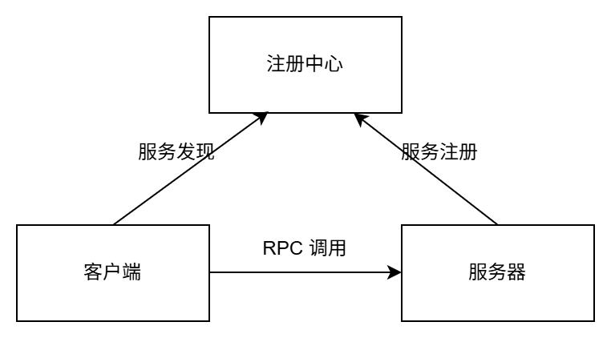
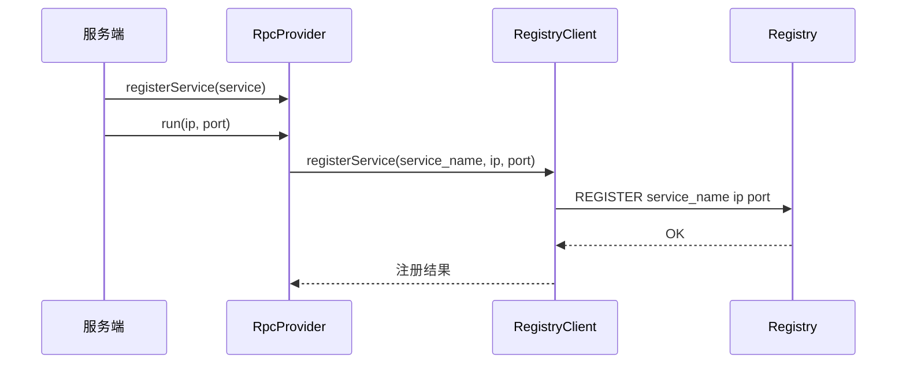
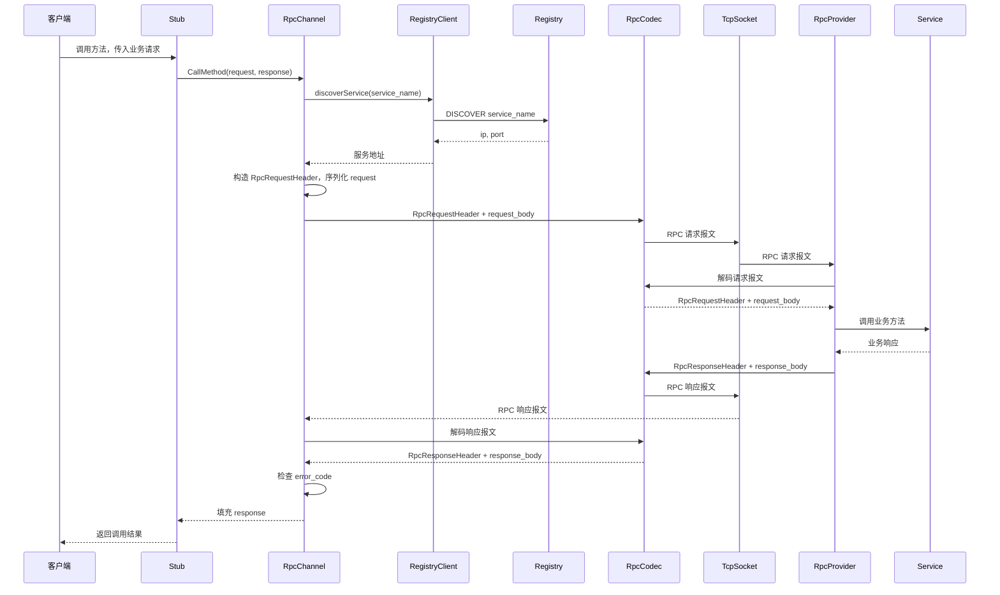

# TinyRPC

## 业务

分布式场景，让调用远程函数像调用本地函数一样简单。

## 功能

用户写 `.proto` 定义接口，服务端实现并注册服务，客户端通过生成的 Stub 发起远程调用。

TinyRPC 封装服务注册/发现、协议编解码、网络通信、序列化/反序列化。

## 系统架构



## 目录结构

```text
tinyrpc/
├── CMakeLists.txt              # 构建配置
├── README.md                   # 项目说明
├── proto/                      # 接口定义
│   ├── calculator.proto         # 计算器服务
│   └── rpc_header.proto         # RPC 请求头
├── src/                        # 框架源码
│   ├── rpc_channel.*            # 客户端调用通道
│   ├── rpc_provider.*           # 服务端注册与分发
│   ├── rpc_controller.*         # 调用错误状态
│   ├── rpc_codec.*              # 协议编解码
│   ├── registry_client.*        # 注册中心客户端
│   └── tcp_socket.*             # TCP 通信封装
├── example/                    # 示例代码
│   ├── client.cpp               # 客户端
│   ├── server.cpp               # 服务端
│   └── registry.cpp             # 注册中心
└── docs/                       # 文档资源
    └── images/                  # 图片资源
```

## 编译运行

编译项目：

```bash
mkdir build
cd build
cmake ..
make
```

启动注册中心：

```bash
./registry
```

启动服务端：

```bash
./server
```

启动客户端：

```bash
./client
```

## 示例说明

示例程序位于 `example/` 目录：

- `registry.cpp`：启动注册中心
- `server.cpp`：实现并注册 `CalculatorService`
- `client.cpp`：通过 Stub 调用远程 `Add` 和 `Sub`

## 类职责

| 类 | 职责 |
| --- | --- |
| Stub | Protobuf 生成的客户端代理 |
| Service | Protobuf 生成的服务基类，业务类继承实现 |
| `RpcChannel` | 客户端调用通道 |
| `RpcProvider` | 服务端注册与请求分发 |
| `RpcCodec` | RPC 请求/响应编解码 |
| `TcpSocket` | TCP 通信封装 |
| `RegistryClient` | 服务注册与发现 |
| `RpcController` | 调用错误状态 |

## 类关系

```text
服务注册：[服务端] Service -> RpcProvider -> RegistryClient -> Registry [注册中心]
服务发现：[客户端] Stub -> RpcChannel -> RegistryClient -> Registry [注册中心]
RPC 调用：[客户端] Stub -> RpcChannel -> RpcCodec -> TcpSocket -> RpcProvider -> Service [服务端]
```

## 数据类型

| 类型 | 说明 |
| --- | --- |
| 业务消息 | 用户 `.proto` 定义的请求/响应对象，如 `AddRequest`、`AddResponse` |
| RPC 请求头消息 | 框架定义的 `RpcRequestHeader`，记录 `service_name`、`method_name`、`request_size` |
| RPC 响应头消息 | 框架定义的 `RpcResponseHeader`，记录 `error_code`、`error_text`、`response_size` |
| RPC 请求报文 | `request_header_size(4字节) + request_header + request_body` |
| RPC 响应报文 | `response_header_size(4字节) + response_header + response_body` |
| 注册中心数据 | 服务注册/发现数据，包括 `service_name`、`ip`、`port` |

## 时序图

### 服务注册



### RPC 调用


