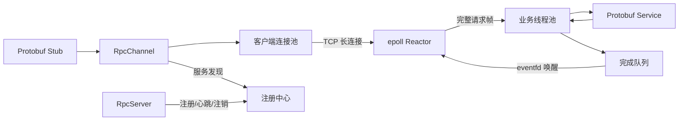

# TinyRPC

TinyRPC 是一个基于 C++17、Protobuf 和 Linux `epoll` 实现的轻量级 RPC 框架。业务只需通过 `.proto` 定义接口，即可使用 Protobuf Stub 像调用本地函数一样发起远程调用。

项目覆盖 RPC 的完整主链路：协议编解码、非阻塞网络、业务线程池、长连接与连接池、服务注册发现、负载均衡、心跳摘除、超时控制和优雅停机。

## 核心能力

- 自定义 RPC 协议：请求头、响应头和业务消息均使用 Protobuf。
- TCP 粘包处理：使用 4 字节网络序长度字段划分完整帧。
- Reactor 服务端：`epoll` 负责连接和非阻塞读写，业务逻辑交给线程池。
- 跨线程通知：工作线程通过完成队列和 `eventfd` 唤醒 Reactor 发送响应。
- 长连接与连接池：单条连接顺序复用，多连接支持客户端并发调用。
- 服务治理：注册中心支持多实例、客户端轮询、心跳续约和超时摘除。
- 故障转移：新建连接失败时依次尝试其他实例。
- 超时控制：服务发现、TCP 建连和单次收发支持可配置超时。
- 优雅停机：停止接收新请求、等待已提交任务结束并主动注销服务。
- 自动化验证：包含协议、超时、生命周期和多实例并发集成测试。

## 架构


```mermaid
flowchart LR
    Stub[Protobuf Stub] --> Channel[RpcChannel]
    Channel --> Pool[客户端连接池]
    Channel -->|服务发现| Registry[注册中心]
    Pool -->|TCP 长连接| Epoll[epoll Reactor]
    Epoll -->|完整请求帧| Workers[业务线程池]
    Workers --> Service[Protobuf Service]
    Service --> Workers
    Workers --> Queue[完成队列]
    Queue -->|eventfd 唤醒| Epoll
    Server[RpcServer] -->|注册/心跳/注销| Registry
```

服务端的主线程只负责网络事件：

```text
EPOLLIN -> 非阻塞读取并组装完整帧 -> 提交业务线程池
业务完成 -> 写入完成队列 -> eventfd 唤醒 Reactor
EPOLLOUT -> 分段发送响应 -> 继续等待下一个请求
```

## 协议格式

```text
TCP 传输报文
+------------------+------------------------------+
| frame_size (4B)  | RPC frame                    |
+------------------+------------------------------+

RPC frame
+------------------+------------------+-----------+
| header_size (4B) | protobuf header  | body      |
+------------------+------------------+-----------+
```

- 请求头：`service_name`、`method_name`。
- 响应头：`success`、`error_message`。
- `frame_size` 和 `header_size` 均使用网络字节序。
- 帧和消息大小均设置上限，防止异常长度导致无限制内存分配。

## 服务治理

注册中心维护 `service_name -> instances`：

- 服务启动时发送 `REGISTER`。
- 服务每 2 秒发送 `HEARTBEAT`。
- 注册中心每秒扫描一次，6 秒未续约的实例会被主动摘除。
- 服务正常停止时发送 `UNREGISTER`，无需等待心跳超时。
- 客户端获取全部实例并按服务维度进行轮询。
- 建连失败时可以切换实例；请求已经发送后不会自动重放，避免非幂等 RPC 重复执行。

## 构建与运行

依赖：Linux、支持 C++17 的编译器、CMake、Protobuf、pthread。

```bash
cmake -S . -B build
cmake --build build -j
```

依次启动注册中心、示例服务端和客户端：

```bash
./build/tinyrpc_registry
./build/calculator_server
./build/calculator_client
```

客户端可以配置连接池和超时：

```cpp
tinyrpc::RpcChannel channel(
    tinyrpc::RpcChannel::Mode::Registry,
    tinyrpc::Endpoint{"127.0.0.1", 9000});

channel.setMaxConnections(8);
channel.setTimeout(1000);
```

`RpcServer::run()` 是阻塞调用。控制线程可以调用 `stop()`，等待 `run()` 返回后再销毁服务对象。

## 测试

```bash
ctest --test-dir build --output-on-failure
```

| 测试 | 覆盖内容 |
| --- | --- |
| `protocol_codec_test` | 请求/响应编解码、非法帧和大小限制 |
| `tcp_socket_timeout_test` | socket 超时及 `TIMEOUT` 错误返回 |
| `service_lifecycle_test` | 服务注册、优雅停机和主动注销 |
| `rpc_integration_test` | 双实例、轮询、连接池并发调用和实例切换 |

网络相关测试会在回环地址上自动选择临时端口，不依赖外部服务。

## 性能基准

基准程序会在进程内启动注册中心和 Calculator 服务，使用共享 `RpcChannel` 发起并发同步调用：

```bash
cmake -S . -B build-release -DCMAKE_BUILD_TYPE=Release
cmake --build build-release -j
./build-release/rpc_benchmark 8 10000
```

参数分别表示线程数和每线程调用次数。

本机回环测试结果：Intel i7-13620H、Ubuntu 24.04、GCC 13.3、Release 构建，8 线程共 80,000 次调用。

| 指标 | 结果 |
| --- | ---: |
| 失败请求 | 0 |
| 吞吐量 | 48,907 QPS |
| P50 延迟 | 154 μs |
| P95 延迟 | 228 μs |
| P99 延迟 | 304 μs |

结果只代表本次本机回环环境，实际性能会受到 CPU、编译参数、业务处理和网络环境影响。

## 目录结构

```text
tinyrpc/
├── include/tinyrpc/             # 框架公开接口
│   ├── client/                  # RpcChannel
│   ├── common/                  # 协议、socket、线程池等
│   ├── registry/                # 注册中心
│   └── server/                  # RpcServer
├── src/                         # 框架实现
├── proto/rpc_header.proto       # RPC 请求头和响应头
├── examples/calculator/         # Calculator 示例
├── tests/                       # 单元测试与集成测试
├── benchmarks/                  # 自包含性能基准
└── docs/images/                 # 架构图片
```

## 当前边界

TinyRPC 面向学习和项目展示，目前采用同步客户端模型：单条连接同一时刻处理一个 RPC，通过连接池获得并发能力。注册中心数据保存在内存中，暂未实现请求多路复用、持久化、TLS、鉴权和跨机一致性协议。

## 简历描述参考

> 基于 C++17、Protobuf 与 epoll 实现轻量级 RPC 框架；设计长度前缀协议解决 TCP 粘包，采用 Reactor + 线程池 + eventfd 完成网络与业务解耦；实现长连接池、多实例注册发现、客户端轮询、心跳摘除、超时控制和优雅停机，并通过端到端并发测试与性能基准验证，8 线程本机回环达到约 4.9 万 QPS、P99 304 μs。
