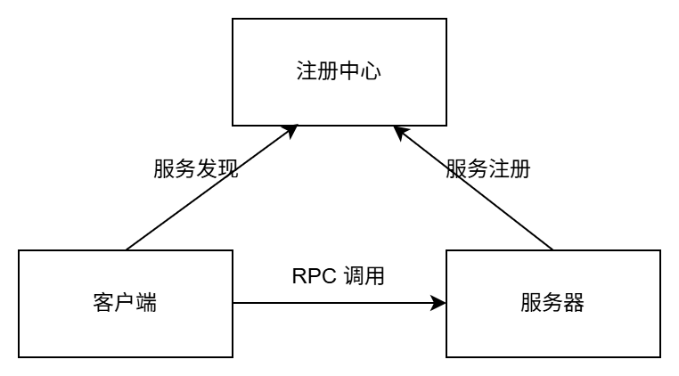
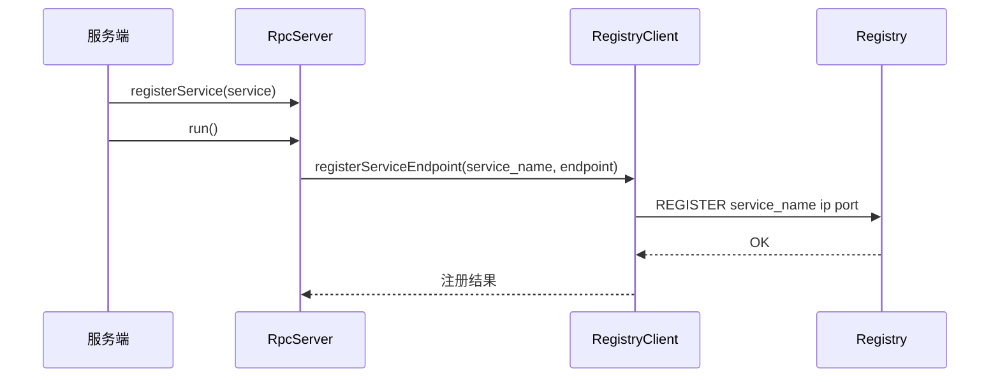
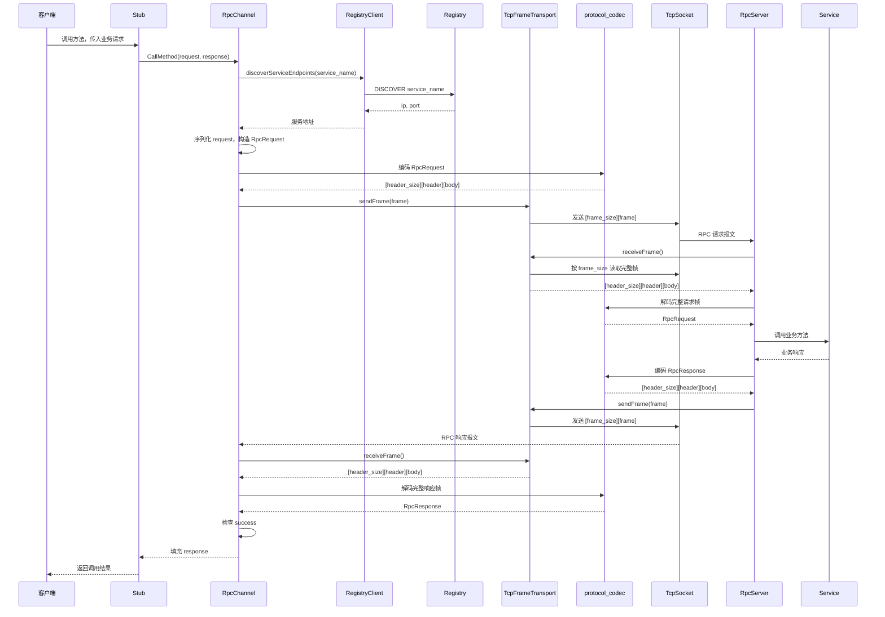

# TinyRPC

## 业务

分布式场景，让调用远程函数像调用本地函数一样简单。

## 功能

用户写 `.proto` 定义接口，服务端实现并注册服务，客户端通过生成的 Stub 发起远程调用。

TinyRPC 封装服务注册/发现、协议编解码、网络通信、序列化/反序列化。

## 系统架构



## 目录结构

```text
tinyrpc/
├── include/tinyrpc/             # 框架头文件
│   ├── client/                  # 客户端接口
│   ├── common/                  # 公共协议与网络接口
│   ├── registry/                # 注册中心接口
│   └── server/                  # 服务端接口
├── src/                         # 框架实现
│   ├── client/
│   ├── common/
│   ├── registry/
│   └── server/
├── examples/calculator/         # 框架使用示例
│   ├── calculator.proto
│   ├── client.cpp
│   └── server.cpp
├── proto/rpc_header.proto       # 框架 RPC 协议
└── docs/images/                 # 文档资源
```

## 编译运行

编译项目：

```bash
cmake -S . -B build
cmake --build build -j
```

启动注册中心：

```bash
./build/tinyrpc_registry
```

启动服务端：

```bash
./build/calculator_server
```

启动客户端：

```bash
./build/calculator_client
```

运行测试：

```bash
ctest --test-dir build --output-on-failure
```

## 示例说明

示例程序位于 `examples/calculator/` 目录：

- `server.cpp`：实现并注册 `CalculatorService`
- `client.cpp`：通过 Stub 调用远程 `Add` 和 `Sub`

注册中心入口位于 `src/registry/main.cpp`。

## 类职责

| 类 | 职责 |
| --- | --- |
| Stub | Protobuf 生成的客户端代理 |
| Service | Protobuf 生成的服务基类，业务类继承实现 |
| `RpcChannel` | 客户端调用通道 |
| `RpcServer` | RPC 服务端，负责服务注册与请求处理 |
| `protocol_codec` 命名空间 | RPC 逻辑消息与帧数据的编码、解码和校验 |
| `TcpFrameTransport` | 通过 TCP 收发 `[frame_size][frame]` |
| `RpcStatus` | RPC 操作的错误码与错误信息 |
| `TcpListener` | TCP 地址绑定与连接接收 |
| `TcpSocket` | TCP 连接的 RAII 管理与数据收发 |
| `RegistryClient` | 服务注册与发现 |
| `RegistryServer` | 保存服务端点并处理注册与发现请求 |
| `RpcController` | 调用错误状态 |

## 类关系

```text
服务注册：[服务端] Service -> RpcServer -> RegistryClient -> Registry [注册中心]
服务发现：[客户端] Stub -> RpcChannel -> RegistryClient -> Registry [注册中心]
RPC 调用：[客户端] Stub -> RpcChannel -> protocol_codec/TcpFrameTransport -> TcpSocket -> RpcServer -> Service [服务端]
```

## 数据类型

| 类型 | 说明 |
| --- | --- |
| 网络端点 | `Endpoint`，保存 IP 地址和端口 |
| 业务消息 | 用户 `.proto` 定义的请求/响应对象，如 `AddRequest`、`AddResponse` |
| RPC 逻辑消息 | 编码前、解码后的 `RpcRequest`、`RpcResponse` |
| RPC 请求头消息 | 框架定义的 `RpcRequestHeader`，记录 `service_name`、`method_name` |
| RPC 响应头消息 | 框架定义的 `RpcResponseHeader`，记录 `success`、`error_message` |
| RPC 帧 | `header_size(4字节) + protobuf header + body` |
| TCP 传输报文 | `frame_size(4字节) + RPC帧` |
| 注册中心数据 | 服务注册/发现数据，包括 `service_name`、`ip`、`port` |

## 时序图

### 服务注册


```mermaid
sequenceDiagram
    participant App as 服务端
    participant Server as RpcServer
    participant RegistryClient
    participant Registry

    App->>Server: registerService(service)
    App->>Server: run()
    Server->>RegistryClient: registerServiceEndpoint(service_name, endpoint)
    RegistryClient->>Registry: REGISTER service_name ip port
    Registry-->>RegistryClient: OK
    RegistryClient-->>Server: 注册结果
```

### RPC 调用


```mermaid
sequenceDiagram
    participant Client as 客户端
    participant Stub
    participant Channel as RpcChannel
    participant RegistryClient
    participant Registry
    participant Transport as TcpFrameTransport
    participant Codec as protocol_codec
    participant Socket as TcpSocket
    participant Server as RpcServer
    participant Service as Service

    Client->>Stub: 调用方法，传入业务请求
    Stub->>Channel: CallMethod(request, response)
    Channel->>RegistryClient: discoverServiceEndpoints(service_name)
    RegistryClient->>Registry: DISCOVER service_name
    Registry-->>RegistryClient: ip, port
    RegistryClient-->>Channel: 服务地址

    Channel->>Channel: 序列化 request，构造 RpcRequest
    Channel->>Codec: 编码 RpcRequest
    Codec-->>Channel: [header_size][header][body]
    Channel->>Transport: sendFrame(frame)
    Transport->>Socket: 发送 [frame_size][frame]
    Socket->>Server: RPC 请求报文

    Server->>Transport: receiveFrame()
    Transport->>Socket: 按 frame_size 读取完整帧
    Transport-->>Server: [header_size][header][body]
    Server->>Codec: 解码完整请求帧
    Codec-->>Server: RpcRequest
    Server->>Service: 调用业务方法
    Service-->>Server: 业务响应

    Server->>Codec: 编码 RpcResponse
    Codec-->>Server: [header_size][header][body]
    Server->>Transport: sendFrame(frame)
    Transport->>Socket: 发送 [frame_size][frame]
    Socket-->>Channel: RPC 响应报文
    Channel->>Transport: receiveFrame()
    Transport-->>Channel: [header_size][header][body]
    Channel->>Codec: 解码完整响应帧
    Codec-->>Channel: RpcResponse
    Channel->>Channel: 检查 success
    Channel-->>Stub: 填充 response
    Stub-->>Client: 返回调用结果
```
